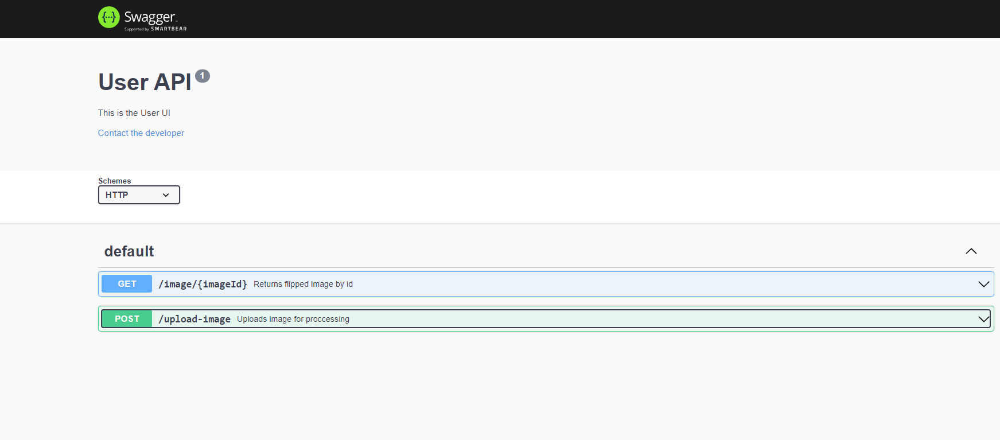

# AWS Task

Upload image and rotate it for 180 degrees

## Table of Contents

- [General Info](#general-information)
- [Technologies Used](#technologies-used)
- [Features](#features)
- [Screenshots](#screenshots)
- [Setup](#setup)
- [Usage](#usage)
- [Project Status](#project-status)
- [Room for Improvement](#room-for-improvement)
- [Acknowledgements](#acknowledgements)
- [Contact](#contact)

## General Information

- The main purpouse of this project is to enable the user to upload an image through Swagger and then user recives rotated image
- This project is made to practice skills in AWS, Docker, Swagger, Express

## Technologies Used

- Nodemon - version 2.0.20
- Express - version 4.18.2
- AWS-sdk - version 2.1291.0
- yamljs - 0.3.0

## Screenshots

## Usage

Download the repository and run

npm run serve

Visit localhost:4000/api-docs

Or pull docker image

sudo docker pull veronikasimic21/aws:latest

and run it

sudo docker run -v ~/.aws:/root/.aws -p 4000:4000 veronikasimic21/aws

## Project Status

Project is: _in progress_

## Acknowledgements

- This project was inspired by Akvelon Inc.
- Special thanks to [@dmitryshulaykin](https://github.com/dmitriyqq)

## Contact

Created by [@veronikasimic](https://github.com/veronika-simic) - feel free to contact me!
